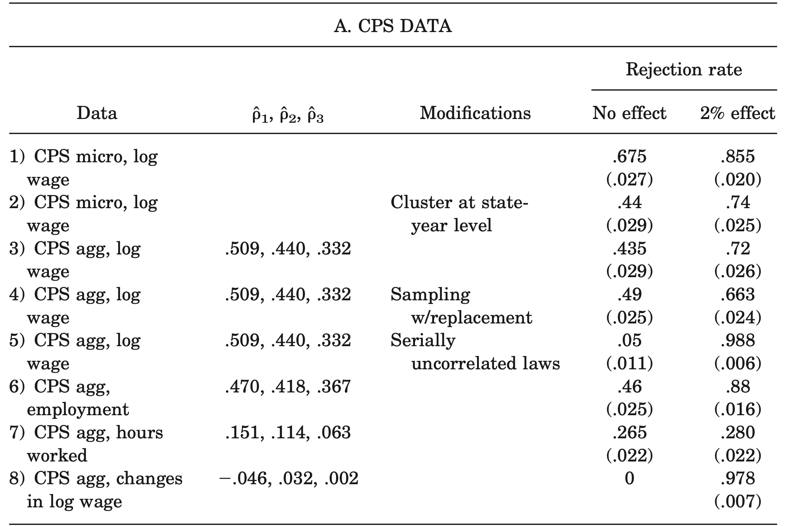
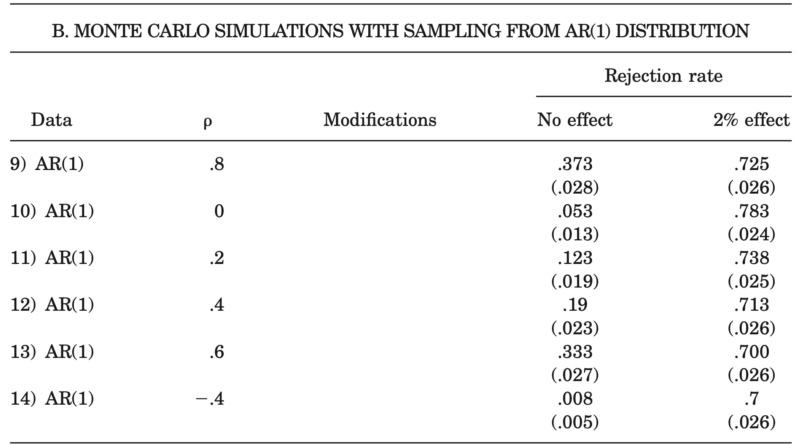
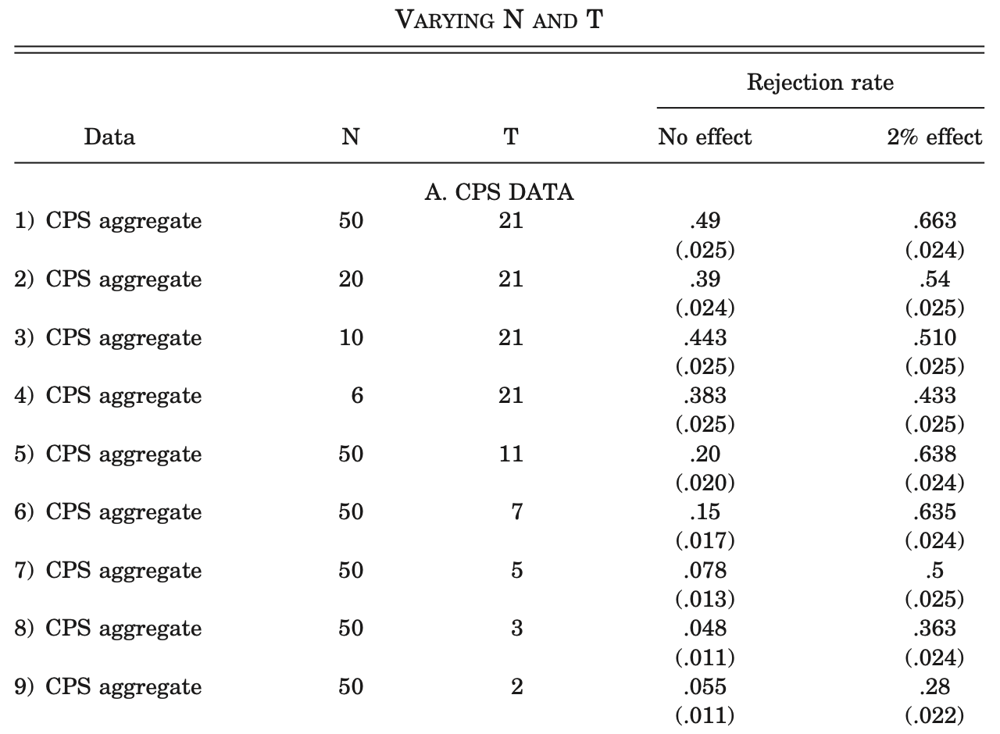
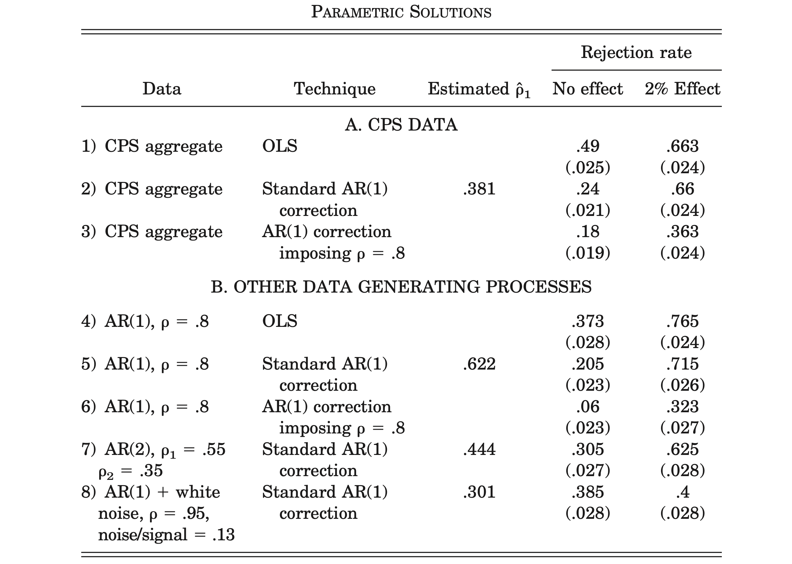
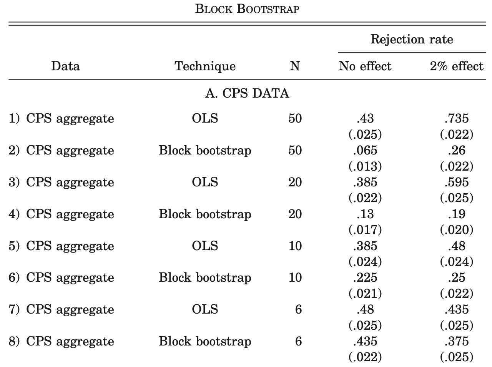
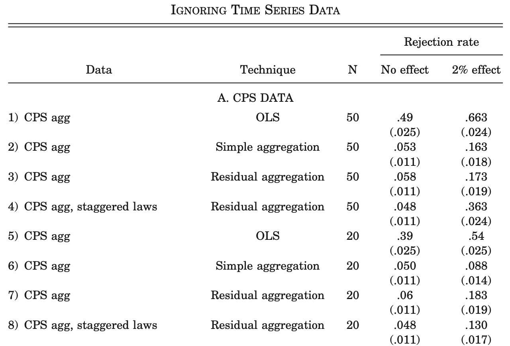
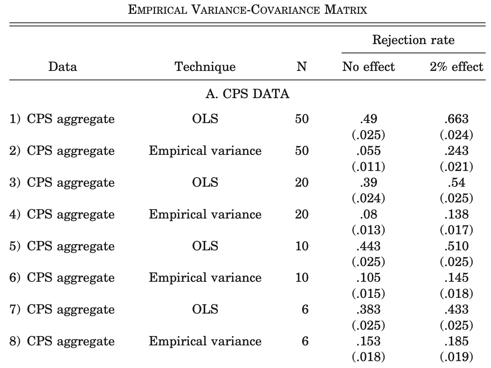
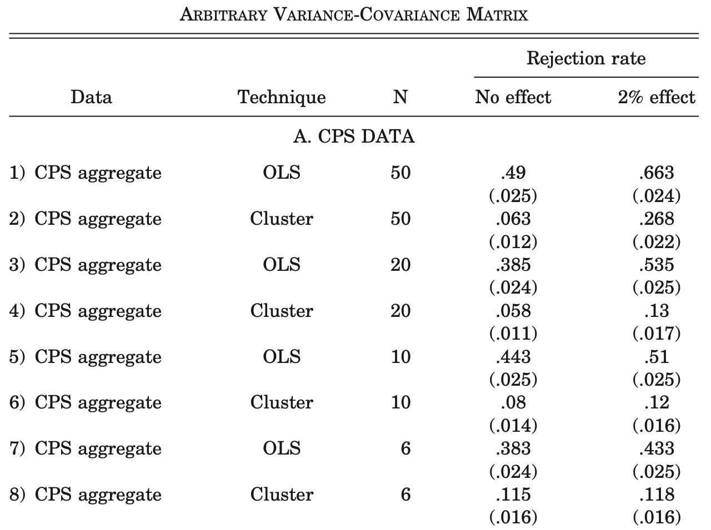

# Introduction

Differences-in-Differences (DD) estimation consists of identifying a specific intervention or treatment. One then compares the difference in outcomes after and before the intervention for groups affected by the intervention to the same difference for unaffected groups.

The great appeal of DD estimation comes from its simplicity as well as its potential to circumvent many of the endogeneity problems that typically arise when making comparisons between heterogeneous individuals.

Obviously, DD estimation also has its limitations. It is appropriate when the interventions are as good as random, conditional on time and group fixed effects. Therefore, much of the debate around the validity of a DD estimate typically revolves around the possible endogeneity of the interventions themselves.

## Introduction

Focus on issues relating to the *standard error* of the estimate.

DD estimates and their standard errors most often derive from using Ordinary Least Squares (OLS) in repeated cross sections (or a panel) of data on individuals in treatment and control groups for several years before and after a specific intervention.

One then typically estimates the following regression using OLS:

\begin{equation}
Y_{ist} = A_s + B_t + cX_{ist} + \beta I_{st} + \varepsilon_{ist},
\end{equation}

where the subscripts $i$, $s$, and $t$ stand for the individual, group (such as a state), and time (such as a year), respectively. Furthermore, let $Y$ be our outcome of interest, $I$ be a dummy, $A$ and $B$ be fixed effects, $X$ be relevant individual controls, and $\varepsilon$ be an error term.

## Introduction

The estimated impact of the intervention is then the OLS estimate $\hat{\beta}$. Standard errors used to form confidence interval for $\hat{\beta}$ are usually OLS standard errors.

\begin{remark}
Note that this is valid only under the very restrictive assumption that changes in the outcome variable over time would have been exactly the same in both treatment and control groups in the absence of the intervention.
\end{remark}

## Introduction

Three factors make serial correlation an especially important issue in the DD context:

1. DD estimation usually relies on fairly long time series.
2. The most commonly used dependent variables in DD estimation are typically highly positively serially correlated.
3. The treatment variable $I_{st}$ changes itself very little within a state over time.

These three factors reinforce each other so that the standard error for $\hat{\beta}$ could severely understate the standard deviation of $\hat{\beta}$.

## Introduction

To assess the extent of this problem, they examine how DD performs on placebo laws, where treated states and year of passage are chosen at random.

Placebo tests diagnose problems with research designs in observational studies. When a researcher estimates a treatment effect based on observational data, the estimator may be biased by confounders, model misspecification, differential measurement error, or other flaws; the researcher may also have constructed confidence intervals incorrectly, such that we would reject the null hypothesis too frequently (or infrequently) under the null. A placebo test checks for an association that should be absent if the research design is sound but not otherwise. Placebo tests can thus be seen as a strategy for checking the soundness of a research finding and, more broadly, improving causal inference.

# A Survey of DD Papers

Papers were classified as "DD" if they focus on specific interventions and use units unaffected by the law as a control group.

|  |  |
| :--- | :---: |
| Number of DD papers | 92 |
| Number with more than 2 periods of data | 69 |
| Number which collapse data into before-after | 4 |
| Number with potential serial correlation problem | 65 |
| Number with some serial correlation correction | 5 |
| GLS | 4 |
| Arbitrary variance-covariance matrix | 1 |
| Number with potential clustering problem | 80 |
| Number which deal with it | 36 |
: Survey of DD papers

## A Survey of DD Papers

| Percentile | Value |
| :---: | :---: |
| 1% | 3 |
| 5% | 3 |
| 10% | 4 |
| 25% | 5.75 |
| 50% | 11 |
| 75% | 21.5 |
| 90% | 36 |
| 95% | 51 |
| 99% | 83 |
| Average | 16.5 |
: Distribution of time span for papers with more than 2 periods

## A Survey of DD Papers

|  |  |
| :--- | :---: |
| Employment | 18 |
| Wages | 13 |
| Health/medical expenditure | 8 |
| Unemployment | 6 |
| Fertility/teen motherhood | 4 |
| Insurance | 4 |
| Poverty | 3 |
| Consumption/savings | 3 |
: Most commonly used dependent variables

## A Survey of DD Papers

|  |  |
| :--- | :---: |
| Graph dynamics of effect | 15 |
| See if effect is persistent | 2 |
| Attempt to do triple-differences (DDD) | 11 |
| Include time trend specific to treated states | 7 |
| Look for effect prior to intervention | 3 |
| Include lagged dependent variable | 3 |
: Informal techniques used to assess endogeneity

# Overrejection in DD Estimation

## Data

The survey above suggests that most DD papers may report standard errors that understate the standard deviation of the DD estimator. To illustrate the magnitude of the problem they turn to a sample of women's wages from the Current Population Survey (CPS).

More specifically, data on:

* Women in their fourth interview month in the Merged Outgoing Rotation Group of the CPS.
* Years: 1979 -- 1999.
* Age: 25 -- 50 y/o.
* Information on weekly earnings, employment status, education, age, and state of residence.

## Data

### Summary

The sample contains:

* Nearly 900,000 observations.
* Approximately 540,000 women report strictly positive weekly earnings.
* $\text{wage} = \log(\text{weekly earnings})$.

This generates ($50 \times 21 = 1050$) state-year cells, with each cell containing on average a little more than 500 women with strictly positive earnings.

## Methodology

The correlogram of the wage residuals was informative enough to estimate first, second, and third autocorrelation coefficients for the mean state-year residuals from a regression of wages on state and year dummies such that they equal 0.51, 0.44, and 0.31, respectively (obtained by a simple OLS regression of the residuals on the corresponding lagged residuals) --- which are high and statistically significant.

## Methodology

Subsequently, in the DD context:

1. Randomly, draw a $\text{year} \sim \mathcal{U}(1985, 1995)$.
2. Select exactly half states (25) at random and designate them as "affected" by the law such that

$$
I_{st} =
\begin{cases}
1 & \text{for all women that live in an affected state} \\
  & \text{after the intervention date,} \\
0 & \text{otherwise}.
\end{cases}
$$

3. Estimate equation (1) using OLS on these placebo laws.

# "If hundreds of researchers analyzed the effects of various laws in the CPS, what fraction would find a significant effect even when the laws have no effect?"

## Methodology

If OLS were to provide consistent standard errors, we would expect to reject the null hypothesis of no effect ($\beta = 0$) roughly 5 percent of the time when using a threshold of 1.96 for the absolute $t$-statistic.

## Methodology

## Methodology

## Methodology

These results demonstrate that, in the presence of positive serial correlation, conventional DD estimation leads to gross overestimation of $t$-statistics and significance levels.

# Solutions

## Parametric Methods

A first possible solution to the serial correlation problem would be to specify an autocorrelation structure for the error term, estimate its parameters, and use these parameters to compute standard errors.

## Parametric Methods

## Block Bootstrap

This variant of bootstrap maintains the autocorrelation structure by keeping all the observations that belong to the same group (e.g., state) together. In practice, we bootstrap the $t$-statistic as follows. For each placebo intervention we compute the absolute $t$-statistic $t = \lvert \hat{\beta} / \text{SE} (\hat{\beta}) \rvert$, using the OLS estimate of $\beta$ and its standard error. We then construct a bootstrap sample by drawing with replacement 50 matrices $(\bar{Y}_s, V_s)$, where $\bar{Y}_s$ is the entire time series of observations for state $s$, and $V_s$ is the matrix of state dummies, time dummies, and treatment dummy for state $s$.

## Block Bootstrap

We then run OLS on this sample. obtain an estimate $\hat{\beta}_r$ and construct the absolute $t$-statistic $t_r = \lvert (\hat{\beta}_r - \hat{\beta}) / \text{SE} (\hat{\beta}_r) \rvert$.

\begin{remark}
The difference between the distribution of $t_r$ and the sampling distribution of $t$ becomes small as $N$ goes to infinity, even in presence of arbitrary autocorrelation within states and heteroskedasticity.
\end{remark}

## Block Bootstrap

## Ignoring Time Series Information

### Simple Aggregation

One could simply average the data before and after the law and run equation (1) on this averaged outcome variable in a panel of length 2 --- this solution will work only for laws that are passed at the same time for all the treated states.

### Residual Aggregation

First, one can regress $Y_{st}$ on state fixed effects, year dummies, and any relevant covariates. One can then divide the residuals of the treatment states only into two groups: residuals from years before the laws, and residuals from years after the laws. The estimate of the laws’ effect and its standard error can then be obtained from an OLS regression in this two-period panel. It also does well when the laws are staggered over time.

## Ignoring Time Series Information

## Empirical Variance-Covariance Matrix

Suppose that the autocorrelation process is the same across all states and that there is **no** cross-section **heteroskedasticity**. In this case, if the data are sorted by states, and years, the variance-covariance matrix of the error term is block diagonal. Each of these blocks is symmetric, and the element $(i, i + j)$ is the correlation between $\varepsilon_i$ and $\varepsilon_{i - j}$. We can therefore use the variation across the 50 states to estimate each element of this matrix, and use this estimated matrix to compute standard errors.

\begin{remark}
Under our initial assumption, this method will produce consistent estimates of the standard error as $N \longrightarrow \infty$.
\end{remark}

## Empirical Variance-Covariance Matrix

## Arbitrary Variance-Covariance Matrix

Since the assumption in the previous method is likely to be violated in practice, this method can be generalized to an estimator of the variance-covariance matrix which is consistent in the presence of any correlation pattern within states over time.

## Arbitrary Variance-Covariance Matrix

This estimator for the variance-covariance matrix is given by

$$
W = (V'V)^{-1} \left( \sum_{j = 1}^N u_j' u_j \right) (V'V)^{-1},
$$

where $V$ is matrix of independent variables (year dummies, state dummies and treatment dummy). Furthermore, $u_j$ is defined as follows

$$
u_j = \sum_{t = 1}^T e_{jt}v_{jt},
$$

where $e_{jt}$ is the estimated residual for state $i$ at time $t$, and $v_{jt}$ is the row vector of dependent variables.

## Arbitrary Variance-Covariance Matrix

# Conclusion

This study suggests that, because of serial correlation, conventional DD standard errors may grossly understate the standard deviation of the estimated treatment effects, leading to serious overestimation of $t$-statistics and significance levels. In other words, it is possible that too many false rejections of the null hypothesis of no effect have taken place.
